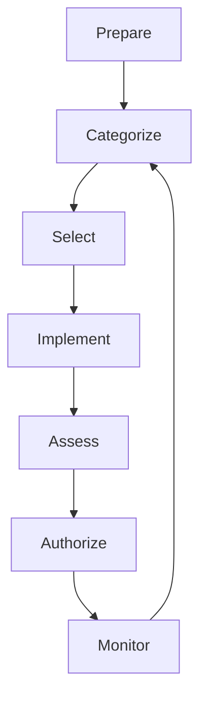

# 🛡️ NIST Risk Management Framework (RMF)  

The **NIST Risk Management Framework (RMF)** is a structured approach for managing security and privacy risks in information systems. Developed by the **National Institute of Standards and Technology (NIST)**, RMF integrates security, privacy, and cyber supply chain risk management into the system development lifecycle.  

---

## 📖 Overview  

The RMF provides a **seven-step process** that helps organizations:  
- Categorize and assess risks.  
- Implement and evaluate controls.  
- Continuously monitor system security.  

> **Purpose**: To ensure systems operate securely within acceptable risk levels, aligning with organizational missions and compliance requirements.  

---

## 🔁 RMF Process Steps  

### Step 1: **Prepare**  
- **Objective**: Establish the foundation for managing security and privacy risks.  
- **Key Activities**:  
  - Identify stakeholders.  
  - Define roles and responsibilities.  
  - Conduct risk assessments.  
- **Output**: Risk management strategy, initial system context.  

---

### Step 2: **Categorize the System**  
- **Objective**: Define the system’s security impact level based on its data and functions.  
- **Key Activities**:  
  - Use [FIPS 199](https://csrc.nist.gov/publications/detail/fips/199/final) to categorize information types.  
  - Identify confidentiality, integrity, and availability requirements.  
- **Output**: System security categorization document.  

---

### Step 3: **Select Controls**  
- **Objective**: Choose appropriate security and privacy controls.  
- **Key Activities**:  
  - Reference [NIST SP 800-53](https://csrc.nist.gov/publications/detail/sp/800-53/rev-5/final).  
  - Tailor controls based on system needs.  
- **Output**: Security and privacy control baseline.  

---

### Step 4: **Implement Controls**  
- **Objective**: Apply the selected controls in the system.  
- **Key Activities**:  
  - Configure system settings.  
  - Document implementation details.  
- **Output**: System security plan (SSP) with implemented controls.  

---

### Step 5: **Assess Controls**  
- **Objective**: Evaluate the effectiveness of implemented controls.  
- **Key Activities**:  
  - Conduct security testing and evaluations.  
  - Identify weaknesses and vulnerabilities.  
- **Output**: Security assessment report (SAR).  

---

### Step 6: **Authorize System**  
- **Objective**: Obtain approval to operate the system based on risk acceptance.  
- **Key Activities**:  
  - Review assessment findings.  
  - Document residual risks.  
  - Issue an authorization to operate (ATO).  
- **Output**: Authorization decision document.  

---

### Step 7: **Monitor**  
- **Objective**: Continuously track system security and privacy post-authorization.  
- **Key Activities**:  
  - Monitor control effectiveness.  
  - Update risk assessments.  
  - Address vulnerabilities promptly.  
- **Output**: Continuous monitoring reports.  

---

## 📊 RMF Workflow  

---

## 🔧 Key Tools and Resources  

- **[NIST SP 800-37](https://csrc.nist.gov/publications/detail/sp/800-37/rev-2/final)**: RMF Guidelines.  
- **[NIST SP 800-53](https://csrc.nist.gov/publications/detail/sp/800-53/rev-5/final)**: Security and Privacy Controls.  
- **[FIPS 199](https://csrc.nist.gov/publications/detail/fips/199/final)**: Security Categorization Standards.  
- **RMF Automation Tools**: Xacta, eMASS, or custom GRC platforms.  

---

## 🎯 Benefits of RMF  

- **Improved Security**: Aligns systems with robust security controls.  
- **Compliance**: Ensures adherence to federal and organizational standards.  
- **Scalability**: Adapts to systems of varying complexity.  
- **Continuous Improvement**: Encourages proactive risk management.  

---

## ⚠️ Challenges  

- **Complexity**: Implementing RMF can be resource-intensive.  
- **Documentation**: Requires extensive record-keeping.  
- **Expertise**: Demands specialized knowledge for effective execution.  

---

## 📚 Learn More  

- [NIST Risk Management Framework Overview](https://csrc.nist.gov/projects/risk-management)  
- [Cybersecurity Framework (CSF)](https://www.nist.gov/cyberframework)  

---

